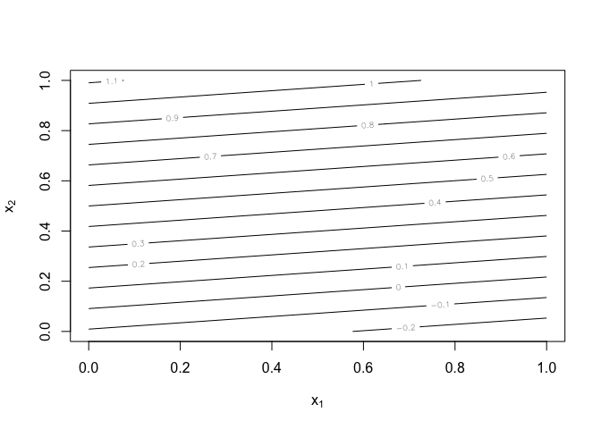
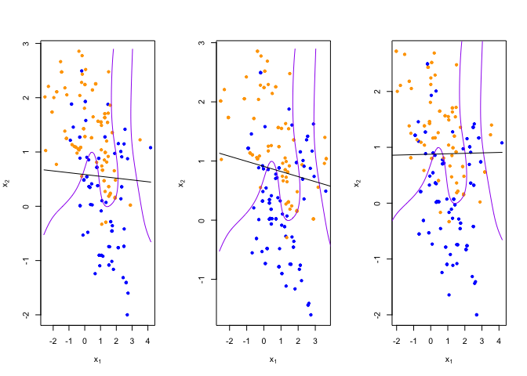

Homework 1
================
Edmund Hui
2023-01-19

``` r
library('class')
library('dplyr')
```

    ## 
    ## Attaching package: 'dplyr'

    ## The following objects are masked from 'package:stats':
    ## 
    ##     filter, lag

    ## The following objects are masked from 'package:base':
    ## 
    ##     intersect, setdiff, setequal, union

``` r
## load binary classification example data from author website 
## 'ElemStatLearn' package no longer available
load(url('https://web.stanford.edu/~hastie/ElemStatLearn/datasets/ESL.mixture.rda'))
dat <- ESL.mixture
```

``` r
plot_mix_data <- function(dat, datboot=NULL) {
  if(!is.null(datboot)) {
    dat$x <- datboot$x
    dat$y <- datboot$y
  }
  plot(dat$x[,1], dat$x[,2],
       col=ifelse(dat$y==0, 'blue', 'orange'),
       pch=20,
       xlab=expression(x[1]),
       ylab=expression(x[2]))
  ## draw Bayes (True) classification boundary
  prob <- matrix(dat$prob, length(dat$px1), length(dat$px2))
  cont <- contourLines(dat$px1, dat$px2, prob, levels=0.5)
  rslt <- sapply(cont, lines, col='purple')
}

plot_mix_data(dat)
```

<!-- -->

``` r
fit_lc <- function(y, x) {
  
  # Original
  #x <- cbind(1, x)
  #beta <- drop(solve(t(x)%*%x)%*%t(x)%*%y)
  
  
  d <- data.frame(y=y, x=x)
  colnames(d) <- c("y", "x1", "x2")
  
  # Using lm
  f <- lm(formula = y ~ x1 + x2, data=d)
  f
}

## make predictions from linear classifier
predict_lc <- function(x, f) {
  #cbind(1, x) %*% beta
  predict(f, data.frame(x))
}

## fit model to mixture data and make predictions
lc_beta <- fit_lc(dat$y, dat$x)
lc_pred <- predict_lc(dat$xnew, lc_beta)

## reshape predictions as a matrix
lc_pred <- matrix(lc_pred, length(dat$px1), length(dat$px2))
contour(lc_pred,
        xlab=expression(x[1]),
        ylab=expression(x[2]))
```

<!-- -->

``` r
## find the contours in 2D space such that lc_pred == 0.5
lc_cont <- contourLines(dat$px1, dat$px2, lc_pred, levels=0.5)

## plot data and decision surface
plot_mix_data(dat)
sapply(lc_cont, lines)
```

<!-- -->

    ## [[1]]
    ## NULL

``` r
## do bootstrap to get a sense of variance in decision surface
resample <- function(dat) {
  idx <- sample(1:length(dat$y), replace = T)
  dat$y <- dat$y[idx]
  dat$x <- dat$x[idx,]
  return(dat)
}
```

``` r
## plot linear classifier for three bootstraps
par(mfrow=c(1,3))
for(b in 1:3) {
  datb <- resample(dat)
  ## fit model to mixture data and make predictions
  lc_beta <- fit_lc(datb$y, datb$x)
  print(lc_beta)
  lc_pred <- predict_lc(datb$xnew, lc_beta)
  
  ## reshape predictions as a matrix
  lc_pred <- matrix(lc_pred, length(datb$px1), length(datb$px2))
  
  ## find the contours in 2D space such that lc_pred == 0.5
  lc_cont <- contourLines(datb$px1, datb$px2, lc_pred, levels=0.5)
  
  ## plot data and decision surface
  plot_mix_data(dat, datb)
  sapply(lc_cont, lines)
}
```

    ## 
    ## Call:
    ## lm(formula = y ~ x1 + x2, data = d)
    ## 
    ## Coefficients:
    ## (Intercept)           x1           x2  
    ##    0.341892     0.008998     0.270403

    ## 
    ## Call:
    ## lm(formula = y ~ x1 + x2, data = d)
    ## 
    ## Coefficients:
    ## (Intercept)           x1           x2  
    ##     0.24349      0.02427      0.28235

    ## 
    ## Call:
    ## lm(formula = y ~ x1 + x2, data = d)
    ## 
    ## Coefficients:
    ## (Intercept)           x1           x2  
    ##    0.277525    -0.002012     0.253828

<!-- -->

Using lm with square terms.

Bias is a term that reflects the difference between the avaerage
prediction of the model and true data. It describes tendancy towards
assumptions inherent in the algorithm which may cause it to miss
relevant relationships.

Variance is a term which reflects how closely a model fits the nuances
of a dataset. It describes the tendancy towards small fluctuations in
data which may cause it to overfit into noise

The bias and variance have a tradeoff relationship. The data scientist
should find an optimal model which does not have so much bias it
underfits (is not able to fit the training set) and not so much variance
that it overfits the training set and thus performs poorly on the test
set

When including square terms the variance increases and bias decreases,
The model can now fit the nuances in the data, but at the same time this
puts it at risk over overfitting, and may be unable to fit a test set
well if provided.

``` r
## fit linear classifier
fit_lc <- function(y, x) {
  
  # Original
  #x <- cbind(1, x)
  #beta <- drop(solve(t(x)%*%x)%*%t(x)%*%y)
  
  
  d <- data.frame(y=y, x=x)
  colnames(d) <- c("y", "x1", "x2")
  
  # Using lm
  #f <- lm(formula = y ~ x1 + x2, data=d)
  
  
  f <- lm(formula = y ~ I(x1^2) + I(x2^2) + I(x1*x2) + x1 + x2, data=d)
  f
}

# ## make predictions from linear classifier
# predict_lc <- function(x, f) {
#   #cbind(1, x) %*% beta
#   predict(f, data.frame(x))
# }

## fit model to mixture data and make predictions
lc_beta <- fit_lc(dat$y, dat$x)
lc_pred <- predict_lc(dat$xnew, lc_beta)

## reshape predictions as a matrix
lc_pred <- matrix(lc_pred, length(dat$px1), length(dat$px2))
contour(lc_pred,
        xlab=expression(x[1]),
        ylab=expression(x[2]))
```

<!-- -->

``` r
## find the contours in 2D space such that lc_pred == 0.5
lc_cont <- contourLines(dat$px1, dat$px2, lc_pred, levels=0.5)

## plot data and decision surface
plot_mix_data(dat)
sapply(lc_cont, lines)
```

<!-- -->

    ## [[1]]
    ## NULL

``` r
# ## fit knn classifier
# ## use 5-NN to estimate probability of class assignment
# knn_fit <- knn(train=dat$x, test=dat$xnew, cl=dat$y, k=5, prob=TRUE)
# knn_pred <- attr(knn_fit, 'prob')
# knn_pred <- ifelse(knn_fit == 1, knn_pred, 1-knn_pred)
# 
# ## reshape predictions as a matrix
# knn_pred <- matrix(knn_pred, length(dat$px1), length(dat$px2))
# contour(knn_pred,
#         xlab=expression(x[1]),
#         ylab=expression(x[2]),
#         levels=c(0.25, 0.5, 0.75))
# 
# 
# ## find the contours in 2D space such that knn_pred == 0.5
# knn_cont <- contourLines(dat$px1, dat$px2, knn_pred, levels=0.5)
# 
# ## plot data and decision surface
# plot_mix_data(dat)
# sapply(knn_cont, lines)
```

``` r
## plot linear classifier for three bootstraps
par(mfrow=c(1,3))
for(b in 1:3) {
  datb <- resample(dat)
  ## fit model to mixture data and make predictions
  lc_beta <- fit_lc(datb$y, datb$x)
  print(lc_beta)
  lc_pred <- predict_lc(datb$xnew, lc_beta)
  
  ## reshape predictions as a matrix
  lc_pred <- matrix(lc_pred, length(datb$px1), length(datb$px2))
  
  ## find the contours in 2D space such that lc_pred == 0.5
  lc_cont <- contourLines(datb$px1, datb$px2, lc_pred, levels=0.5)
  
  ## plot data and decision surface
  plot_mix_data(dat, datb)
  sapply(lc_cont, lines)
}
```

    ## 
    ## Call:
    ## lm(formula = y ~ I(x1^2) + I(x2^2) + I(x1 * x2) + x1 + x2, data = d)
    ## 
    ## Coefficients:
    ## (Intercept)      I(x1^2)      I(x2^2)   I(x1 * x2)           x1           x2  
    ##     0.28599     -0.02367     -0.07998     -0.11494      0.07586      0.43994

    ## 
    ## Call:
    ## lm(formula = y ~ I(x1^2) + I(x2^2) + I(x1 * x2) + x1 + x2, data = d)
    ## 
    ## Coefficients:
    ## (Intercept)      I(x1^2)      I(x2^2)   I(x1 * x2)           x1           x2  
    ##    0.282840     0.017282    -0.020237    -0.003266    -0.027961     0.295836

    ## 
    ## Call:
    ## lm(formula = y ~ I(x1^2) + I(x2^2) + I(x1 * x2) + x1 + x2, data = d)
    ## 
    ## Coefficients:
    ## (Intercept)      I(x1^2)      I(x2^2)   I(x1 * x2)           x1           x2  
    ##     0.23460     -0.03203     -0.12194     -0.15811      0.19090      0.54271

<!-- -->

``` r
## plot 5-NN classifier for three bootstraps
# par(mfrow=c(1,3))
# for(b in 1:3) {
#   datb <- resample(dat)
#   
#   knn_fit <- knn(train=datb$x, test=datb$xnew, cl=datb$y, k=5, prob=TRUE)
#   knn_pred <- attr(knn_fit, 'prob')
#   knn_pred <- ifelse(knn_fit == 1, knn_pred, 1-knn_pred)
#   
#   ## reshape predictions as a matrix
#   knn_pred <- matrix(knn_pred, length(datb$px1), length(datb$px2))
#   
#   ## find the contours in 2D space such that knn_pred == 0.5
#   knn_cont <- contourLines(datb$px1, datb$px2, knn_pred, levels=0.5)
#   
#   ## plot data and decision surface
#   plot_mix_data(dat, datb)
#   sapply(knn_cont, lines)
# }
# 
# ## plot 20-NN classifier for three bootstraps
# par(mfrow=c(1,3))
# for(b in 1:3) {
#   datb <- resample(dat)
#   
#   knn_fit <- knn(train=datb$x, test=datb$xnew, cl=datb$y, k=20, prob=TRUE)
#   knn_pred <- attr(knn_fit, 'prob')
#   knn_pred <- ifelse(knn_fit == 1, knn_pred, 1-knn_pred)
#   
#   ## reshape predictions as a matrix
#   knn_pred <- matrix(knn_pred, length(datb$px1), length(datb$px2))
#   
#   ## find the contours in 2D space such that knn_pred == 0.5
#   knn_cont <- contourLines(datb$px1, datb$px2, knn_pred, levels=0.5)
#   
#   ## plot data and decision surface
#   plot_mix_data(dat, datb)
#   sapply(knn_cont, lines)
# }
```
