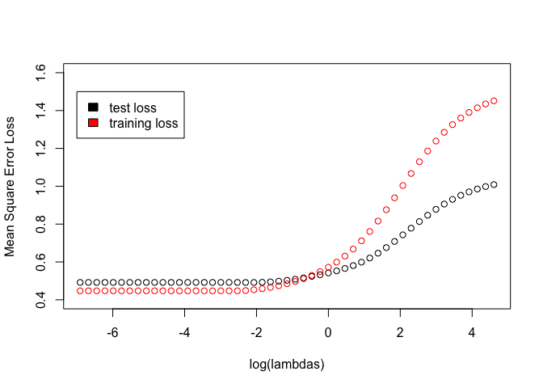

Homework 3
================
Edmund Hui
2023-02-09

``` r
library('splines')        ## for 'bs'
library('dplyr')          ## for 'select', 'filter', and others
```

    ## 
    ## Attaching package: 'dplyr'

    ## The following objects are masked from 'package:stats':
    ## 
    ##     filter, lag

    ## The following objects are masked from 'package:base':
    ## 
    ##     intersect, setdiff, setequal, union

``` r
library('magrittr')       ## for '%<>%' operator
library('glmnet')         ## for 'glmnet'
```

    ## Loading required package: Matrix

    ## Loaded glmnet 4.1-6

``` r
#1 
prostate <- 
  read.table(url(
    'https://web.stanford.edu/~hastie/ElemStatLearn/datasets/prostate.data'))
```

``` r
#2
prostate_train = prostate %>% filter(train==TRUE)
prostate_test = prostate %>% filter(train==FALSE)
cor(prostate_train[, 1:(dim(prostate)[2]-1)])
```

    ##             lcavol    lweight       age        lbph        svi         lcp
    ## lcavol  1.00000000 0.30023199 0.2863243  0.06316772  0.5929491  0.69204308
    ## lweight 0.30023199 1.00000000 0.3167235  0.43704154  0.1810545  0.15682859
    ## age     0.28632427 0.31672347 1.0000000  0.28734645  0.1289023  0.17295140
    ## lbph    0.06316772 0.43704154 0.2873464  1.00000000 -0.1391468 -0.08853456
    ## svi     0.59294913 0.18105448 0.1289023 -0.13914680  1.0000000  0.67124021
    ## lcp     0.69204308 0.15682859 0.1729514 -0.08853456  0.6712402  1.00000000
    ## gleason 0.42641407 0.02355821 0.3659151  0.03299215  0.3068754  0.47643684
    ## pgg45   0.48316136 0.07416632 0.2758057 -0.03040382  0.4813577  0.66253335
    ## lpsa    0.73315515 0.48521519 0.2276424  0.26293763  0.5568864  0.48920320
    ##            gleason       pgg45      lpsa
    ## lcavol  0.42641407  0.48316136 0.7331551
    ## lweight 0.02355821  0.07416632 0.4852152
    ## age     0.36591512  0.27580573 0.2276424
    ## lbph    0.03299215 -0.03040382 0.2629376
    ## svi     0.30687537  0.48135774 0.5568864
    ## lcp     0.47643684  0.66253335 0.4892032
    ## gleason 1.00000000  0.75705650 0.3424278
    ## pgg45   0.75705650  1.00000000 0.4480480
    ## lpsa    0.34242781  0.44804795 1.0000000

``` r
#3 #4
prostate_train <- prostate_train %>% select(-c(train))
fit = lm(lcavol ~ ., data=prostate_train)
```

``` r
#5
mean((prostate_test$lcavol - predict(fit, newdata=prostate_test %>% select(-c(train, lcavol))))^2)
```

    ## [1] 0.5084068

``` r
X_train <- prostate_train[, 1:(dim(prostate)[2]-1)] %>% select(-c(lcavol))
y_train <- prostate_train$lcavol
X_test <- prostate_test[, 1:(dim(prostate)[2]-1)] %>% select(-c(lcavol))
y_test <- prostate_test$lcavol
```

``` r
#6
lambdas <- 10^seq(2, -3, by = -.1)
fit_ridge <- glmnet(X_train, y_train , alpha=0, lambdas=lambdas)

cv_fit_ridge <- cv.glmnet(data.matrix(X_train), y_train, alpha=0, lambda=lambdas)

# Optimal lambda
cv_fit_ridge$lambda.min
```

    ## [1] 0.05011872

``` r
preds_train <- predict(fit_ridge, s=lambdas, newx=data.matrix(X_train))
train_losses <- colMeans((preds_train - y_train) ^ 2)
```

``` r
y_pred <- predict(fit_ridge, s=lambdas, newx=data.matrix(X_test))
test_losses <- colMeans((y_pred - y_test) ^ 2)
```

``` r
plot(log(lambdas), test_losses, ylim=c(0.4, 1.6), ylab="Mean Square Error Loss")
points(log(lambdas), train_losses, col="red")
legend(-7, 1.5, legend=c("test loss", "training loss"), fill=c("black", "red"))
```

<!-- -->

``` r
plot(fit_ridge, xvar="lambda", label=TRUE) 
```

<!-- -->
