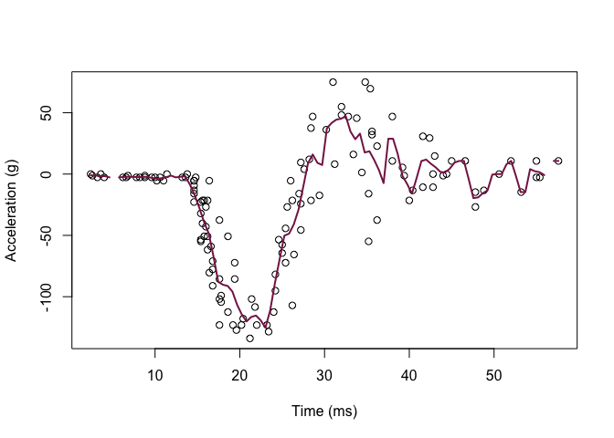

Homework 4
================
Edmund Hui
2023-02-26

``` r
#install.packages('manipulate')
```

``` r
library('MASS') ## for 'mcycle'
library('manipulate') ## for 'manipulate'
```

``` r
y <- mcycle$accel
x <- matrix(mcycle$times, length(mcycle$times), 1)

plot(x, y, xlab="Time (ms)", ylab="Acceleration (g)")
```

<!-- -->

``` r
## Epanechnikov kernel function
## x  - n x p matrix of training inputs
## x0 - 1 x p input where to make prediction
## lambda - bandwidth (neighborhood size)
kernel_epanechnikov <- function(x, x0, lambda=1) {
  d <- function(t)
    ifelse(t <= 1, 3/4*(1-t^2), 0)
  z <- t(t(x) - x0)
  d(sqrt(rowSums(z*z))/lambda)
}

## k-NN kernel function
## x  - n x p matrix of training inputs
## x0 - 1 x p input where to make prediction
## k  - number of nearest neighbors
kernel_k_nearest_neighbors <- function(x, x0, k=1) {
  ## compute distance betwen each x and x0
  z <- t(t(x) - x0)
  d <- sqrt(rowSums(z*z))

  ## initialize kernel weights to zero
  w <- rep(0, length(d))
  
  ## set weight to 1 for k nearest neighbors
  w[order(d)[1:k]] <- 1
  
  return(w)
}

## Make predictions using the NW method
## y  - n x 1 vector of training outputs
## x  - n x p matrix of training inputs
## x0 - m x p matrix where to make predictions
## kern  - kernel function to use
## ... - arguments to pass to kernel function
nadaraya_watson <- function(y, x, x0, kern, ...) {
  k <- t(apply(x0, 1, function(x0_) {
    k_ <- kern(x, x0_, ...)
    k_/sum(k_)
  }))
  yhat <- drop(k %*% y)
  attr(yhat, 'k') <- k
  return(yhat)
}

## Helper function to view kernel (smoother) matrix
matrix_image <- function(x) {
  rot <- function(x) t(apply(x, 2, rev))
  cls <- rev(gray.colors(20, end=1))
  image(rot(x), col=cls, axes=FALSE)
  xlb <- pretty(1:ncol(x))
  xat <- (xlb-0.5)/ncol(x)
  ylb <- pretty(1:nrow(x))
  yat <- (ylb-0.5)/nrow(x)
  axis(3, at=xat, labels=xlb)
  axis(2, at=yat, labels=ylb)
  mtext('Rows', 2, 3)
  mtext('Columns', 3, 3)
}

## Compute effective df using NW method
## y  - n x 1 vector of training outputs
## x  - n x p matrix of training inputs
## kern  - kernel function to use
## ... - arguments to pass to kernel function
effective_df <- function(y, x, kern, ...) {
  y_hat <- nadaraya_watson(y, x, x,
    kern=kern, ...)
  sum(diag(attr(y_hat, 'k')))
}

## loss function
## y    - train/test y
## yhat - predictions at train/test x
loss_squared_error <- function(y, yhat)
  (y - yhat)^2

## test/train error
## y    - train/test y
## yhat - predictions at train/test x
## loss - loss function
error <- function(y, yhat, loss=loss_squared_error)
  mean(loss(y, yhat))

## AIC
## y    - training y
## yhat - predictions at training x
## d    - effective degrees of freedom
aic <- function(y, yhat, d)
  error(y, yhat) + 2/length(y)*d

## BIC
## y    - training y
## yhat - predictions at training x
## d    - effective degrees of freedom
bic <- function(y, yhat, d)
  error(y, yhat) + log(length(y))/length(y)*d
```

``` r
## make predictions using NW method at training inputs
y_hat <- nadaraya_watson(y, x, x,
  kernel_epanechnikov, lambda=5)

## view kernel (smoother) matrix
matrix_image(attr(y_hat, 'k'))
```

<!-- -->

``` r
## compute effective degrees of freedom
edf <- effective_df(y, x, kernel_epanechnikov, lambda=5)
aic(y, y_hat, edf)
```

    ## [1] 677.1742

``` r
bic(y, y_hat, edf)
```

    ## [1] 677.3629

``` r
## create a grid of inputs 
x_plot <- matrix(seq(min(x),max(x),length.out=100),100,1)

## make predictions using NW method at each of grid points
y_hat_plot <- nadaraya_watson(y, x, x_plot,
  kernel_epanechnikov, lambda=1)

## plot predictions
plot(x, y, xlab="Time (ms)", ylab="Acceleration (g)")
lines(x_plot, y_hat_plot, col="#882255", lwd=2)
```

<!-- -->

``` r
# how does k affect shape of predictor and eff. df using k-nn kernel ?
# manipulate({
#   ## make predictions using NW method at training inputs
#   y_hat <- nadaraya_watson(y, x, x,
#     kern=kernel_k_nearest_neighbors, k=k_slider)
#   edf <- effective_df(y, x,
#     kern=kernel_k_nearest_neighbors, k=k_slider)
#   aic_ <- aic(y, y_hat, edf)
#   bic_ <- bic(y, y_hat, edf)
#   y_hat_plot <- nadaraya_watson(y, x, x_plot,
#     kern=kernel_k_nearest_neighbors, k=k_slider)
#   plot(x, y, xlab="Time (ms)", ylab="Acceleration (g)")
#   legend('topright', legend = c(
#     paste0('eff. df = ', round(edf,1)),
#     paste0('aic = ', round(aic_, 1)),
#     paste0('bic = ', round(bic_, 1))),
#     bty='n')
#   lines(x_plot, y_hat_plot, col="#882255", lwd=2)
# }, k_slider=slider(1, 10, initial=3, step=1))
# 
```

## Q1

``` r
n_train = floor(0.75 * nrow(mcycle))

set.seed(42)
train_ind = sample(seq_len(nrow(mcycle)), size=n_train)

train <- mcycle[train_ind, ]
val <- mcycle[-train_ind, ]

x_train <- train$accel
y_train <- matrix(train$times, length(train$times), 1)

x_val <- val$accel
y_val <- matrix(val$times, length(val$times), 1)
```

## Q2 - Q4

``` r
# Create CV folds
n_per_fold <- ceiling(dim(mcycle)[1]/5)
len_data <- dim(x)[1]

folds <- split(sample(1:len_data, size=len_data), ceiling(seq_along(1:len_data)/n_per_fold))
```

``` r
# Matrices to store data
res <- matrix(nrow=40, ncol=4)
cv_res <- matrix(nrow=40, ncol=5)

for(i in 1:40){
  
  yhat_train <- nadaraya_watson(x_train, y_train, matrix(x_train), kern=kernel_k_nearest_neighbors, k=i)
  yhat_val <- nadaraya_watson(x_train, y_train, matrix(x_val), kern=kernel_k_nearest_neighbors, k=i)
  
  # training error
  res[i, 1] <- error(y_train, yhat_train, loss=loss_squared_error)
  
  # val error
  res[i, 2] <- error(y_val, yhat_val, loss=loss_squared_error)
  
  #edf
  edf <- effective_df(y_train, matrix(x_train), kern=kernel_k_nearest_neighbors, k=i)
  
  # aic
  res[i, 3] <- aic(y_train, yhat_train, edf)
  
  # bic
  res[i, 4] <- bic(y_train, yhat_train, edf)
  
  # 5 fold CV
  j <- 1
  for(fold in folds){
    val_cv <- mcycle[fold, ]
    train_cv <- mcycle[-fold, ]
    
    x_train_cv <- train_cv$accel
    y_train_cv <- matrix(train_cv$times, length(train_cv$times), 1)
    x_val_cv <- val_cv$accel
    y_val_cv <- matrix(val_cv$times, length(val_cv$times), 1)
    
    yhat_val_cv <- nadaraya_watson(x_train_cv, y_train_cv, matrix(x_val_cv), kern=kernel_k_nearest_neighbors, k=i)
    cv_res[i, j] <- error(y_val_cv, yhat_val_cv, loss=loss_squared_error)
    j <- j+1
  }
}
```

## Q5

``` r
avg_cvlosses <- rowMeans(cv_res)
cv_sd <- apply(cv_res, 1, sd) / sqrt(5)

plot(1:40, avg_cvlosses, xlab="k", ylim=c(800, 1800))
arrows(x0=1:40, y0=avg_cvlosses-cv_sd, x1=1:40, y1=avg_cvlosses + cv_sd, code=3, angle=90, length=0.1)
```

<!-- -->

## Q6

Apply the one standard error rule.

``` r
min_k <- which.min(avg_cvlosses)
min_k_loss = min(avg_cvlosses)
min_k_sd <- cv_sd[min_k]
```

maximum k which falls within one standard error of the loss of the
minimum

``` r
max(which(avg_cvlosses < min_k_loss + min_k_sd))
```

    ## [1] 21
