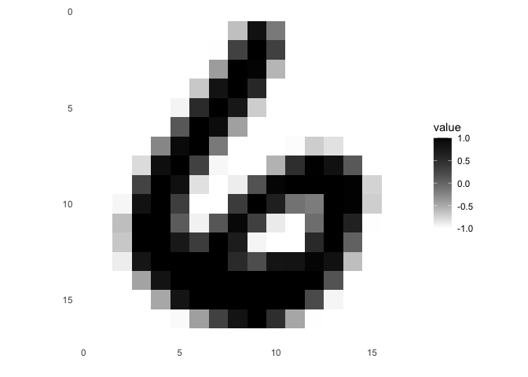

Homework 6
================
Edmund Hui
2023-04-12

``` r
#install.packages("keras")
```

``` r
library(tidyverse)
```

    ## ── Attaching packages ─────────────────────────────────────── tidyverse 1.3.2 ──
    ## ✔ ggplot2 3.4.2     ✔ purrr   0.3.5
    ## ✔ tibble  3.2.1     ✔ dplyr   1.1.1
    ## ✔ tidyr   1.2.1     ✔ stringr 1.4.1
    ## ✔ readr   2.1.3     ✔ forcats 0.5.2
    ## ── Conflicts ────────────────────────────────────────── tidyverse_conflicts() ──
    ## ✖ dplyr::filter() masks stats::filter()
    ## ✖ dplyr::lag()    masks stats::lag()

``` r
library(pracma)
```

    ## 
    ## Attaching package: 'pracma'
    ## 
    ## The following object is masked from 'package:purrr':
    ## 
    ##     cross

``` r
library(ggplot2)
library(keras)
library(tensorflow)
#install_keras()
#use_condaenv("r-tensorflow")
```

``` r
train_digits <- read.csv('~/Downloads/zip.train.csv', sep=' ', header=FALSE)
test_digits <- read.csv('~/Downloads/zip.train.csv', sep=' ', header=FALSE)
```

``` r
#digits[, c("V258")]
train_images <- as.matrix(train_digits[-c(1, 258)], byrow=TRUE)
train_images <- array_reshape(train_images, c(7291, 16, 16), order=c("C"))
train_labels <- as.vector(train_digits[['V1']])

test_images <- as.matrix(test_digits[-c(1, 258)], byrow=TRUE)
test_images <- array_reshape(test_images, c(7291, 16, 16), order=c("C"))
test_labels <- as.vector(test_digits[['V1']])
```

## Check Image

``` r
image_1 <- as.data.frame(train_images[1, , ])
colnames(image_1) <- seq_len(ncol(image_1))
image_1$y <- seq_len(nrow(image_1))
image_1 <- gather(image_1, "x", "value", -y)
image_1$x <- as.integer(image_1$x)

ggplot(image_1, aes(x = x, y = y, fill = value)) +
  geom_tile() +
  scale_fill_gradient(low = "white", high = "black", na.value = NA) +
  scale_y_reverse() +
  theme_minimal() +
  theme(panel.grid = element_blank())   +
  theme(aspect.ratio = 1) +
  xlab("") +
  ylab("")
```

<!-- --> \## Define Model

``` r
model <- keras_model_sequential() %>%
  layer_conv_2d(filters=2, kernel_size=c(3,3), strides = c(1L,1L), input_shape=c(16,16,1), activation='relu') %>%
  layer_conv_2d(filters=4, kernel_size=c(5,5), strides=c(1L, 1L), activation='relu') %>%
  layer_flatten() %>%
  layer_dense(10)
```

``` r
loss_fn <- loss_sparse_categorical_crossentropy(from_logits = TRUE)

model %>% compile(
  optimizer = "adam",
  loss = loss_fn,
  metrics = "accuracy"
)
```

``` r
model %>% fit(train_images, train_labels)
```

## Test Model

``` r
eval <- model %>% evaluate(test_images, test_labels)
```

## Plot the graph

``` r
model <- keras_model_sequential() %>%
  layer_conv_2d(filters=2, kernel_size=c(3,3), strides = c(1L,1L), input_shape=c(16,16,1), activation='relu') %>%
  layer_conv_2d(filters=4, kernel_size=c(5,5), strides=c(1L, 1L), activation='relu') %>%
  layer_flatten() %>%
  layer_dense(10)
  
model %>% compile(
  optimizer = "adam",
  loss = loss_fn,
  metrics = "accuracy"
)

hist <- model %>% fit(train_images, train_labels, validation_data=list(test_images, test_labels), epochs=15)

plot(1:15, unlist(hist$metrics["val_accuracy"]), xlab="Training Epochs", ylab="% Correct on Test Data", type="b")
```

<!-- -->
